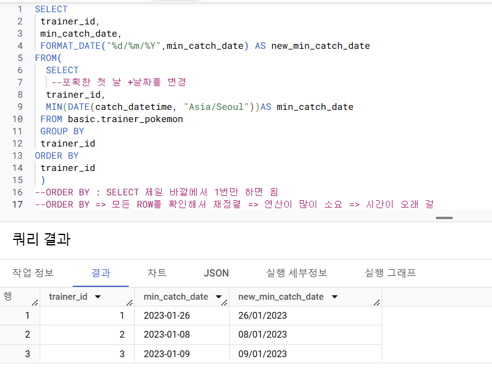

 ## 4-4. 날짜 및 시간 데이터 이해하기 (2)
**DATETIME 함수 - CURRENT_DATETIME**

CURRENT_DATETIME([time-zone]) : 현재 DATETIME 출력

 ```sql
SELECT 
  CURRENT_DATE() AS current_date,
  CURRENT_DATE("Asia/Seoul") AS  asia_date,
  CURRENT_dATETIME () AS current_datetime,  
  CURRENT_DATETIME("Asia/Seoul") AS current_datetime_asia;
 `````
일하는 시간(오전 9시~18시)에는 차이 안 나서 timezone 굳이 필요없을 수 있는데 그 전에는 datetime 차이날 수 있음

**DATETIME 함수 - EXTRACT : DATETIME에서 특정 부분만 추출하고 싶은 경우**
```sql
EXTRACT (part FROM datetime_expression)

SELECT
 EXTRACT(DATE FROM DATETIME "2024-01-02 14:00:00*) AS date, 
 EXTRACT(YEAR FROM DATETIME "2024-01-02 14:00:00*) AS year,
 XTRACT(MONTH FROM DATETIME "2024-01-02 14:00:00* AS DATETIME) AS month, 
 EXTRACT(DAY FROM DATETIME "2024-01-02 14:00:00* AS DATETIME) AS day, 
 EXTRACT(HOUR FROM DATETIME "2024-01-02 14:00:00* AS DATETIME) AS hour, 
 EXTRACT(MINUTE FROM DATETIME "2024-01-02 14:00:00* AS DATETIME) AS minute,
`````
요일을 추출하고 싶은 경우 extract(DAYOFWEEK from datetime_col) 한 주의 첫날이 일요일인 [1,7] 범위의 값을 반환 

**DATE와 HOUR만 남기고 싶은 경우 => 시간자르기**

DATETIME_TRUNC(datetime_col, HOUR)

**문자열로 저장된 DATETIME을 DATETIME 타입으로 바꾸고 싶은 경우**

PARSE_DATETIME('문자열의 형태', 'DATETIME 문자열') AS datetime

```sql
SELECT
 PARSE_DATETIME('%Y-%m-%d %H:%M:%S', '2024-01-11 12:35:35') AS parse_datetime;
```
** parsing 문자열를 분석해서 알맞은 것으로 대체 ** 

**DATETIME 타입 데이터를 특정 형태의 문자열 데이터로 변환하고 싶은 경우**
```sql
SELECT
 PARSE_DATETIME("%c", DATETIME "2024-01-11 12:35:35") AS formatted;
```
문자열 => DATETIME : PARSE_DATETIME
DATETIME => 문자열 : FORAMAT_DATETIME

마지막 날을 알고 싶은 경우 : 자동으로 월의 마지막 값을 계산해서 특정 연산을 할 경우 : LAST_DAY(DATETIME) : 월의 마지막 값을 반환

두 DATETIME의 차이를 알고 싶은 경우
DATETIME_DIFF (첫 DATETIME, 두번째 DATETIME, 궁금한 차이)

**정리**
~~~
날짜 및 시간 데이터 타입
-DATE
-DATETIME : DATE+TIME. 타임존 정보 X
-TIMESTAMP : 특정 시점에 도장 찍은 값. 타임존 정보 O
-UTC : 국제적인 표준시간. 한국은 UTC+9
-Millisecond : 1/1000초
-Microsecond :1/1000ms
~~~

 ## 4-5. 연습문제





 ## 4-6. 조건문 (CASE WHEN, IF)
 **조건문**
 ~~~
 -만약 특정 조건이 충족되면, 어떤 행동을 하자 
 -특정 조건이 참일 떄 A, 아니면 B
 -조건에 따른 분기 처리, 다른 값을 표시하고 싶을 때 사용

 사용 이유;
 데이터 분석을 하다보면 특정 카테고리를 하나로 합치는 전처리가 필요함 (ex. 123 학년을 저학년 456 학년을 고학년으로 합치기)
 데이터를 저장하는 쪽과 데이터를 분석하는 쪽으로 보통 나뉘는데 분석할 때 필요한 부분에서 조건 설정해서 변경하는 것이 더 유용 저장할 때부터 특정 카테고리를 합쳐서 저장하면 쪼개서 보고 싶을 때 볼 수 없음
 ~~~

 사용하는 방법
 1) CASE WHEN
 ```sql
SELECT
 CASE
 WHEN 조건1 THEN 조건1이 참일 경우 결과
 WHEN 조건2 THEN 조건2가 참일 경우 결과
 ELSE 그 외 조건일 경우 결과
END AS 새로운 컬럼 이름

-조건1, 조건2 둘 다 해당하면 앞선 순서를 따름
-문자열 함수 (특정단어 추출)에서 이슈가 자주 발생
```

2) IF : 단일 조건문일 경우 유용
```sql
IF(조건문, TRUE일 떄의 값, False일 때의 값) AS 새로운_컬럼_이름

SELECT
 IF(1=1, '동일한 결과', '동일하지 않은 결과') AS result1,
 IF(1=2, '동일한 결과', '동일하지 않은 결과') AS result2
```
 ## 연습문제


## 4-8. 정리
```sql
 SELECT
  컬럼1,
  컬럼2,
  컬럼3
FROM 테이블
WHERE <조건문>
GROUP BY <집계할 컬럼>
```
~~~
데이터타입 : 
- 숫자(사칙연산 SAFE_DIVIDE)
- 문자 CONCAT, SPLIT, REPLACE, TRIM, UPPER)
- 시간/날짜 
(EXTRACT(HOW FROM datetime)
DATETIME_TRUNC
PARSE_DATETIME)
**UTC, DATETIME, TIMESTAMP
- 부울 (데이터 타입 변경하기 
조건문 : 특정조건이면 변경하기
CASE WHEN
IF)
~~~

## 4-9. BigQuery 공식 문서 확인하는 법
찾는 방법 : "기술명+ documentation"으로 검색

~~~
string 함수 문법 찾는 방법 : 공식문서에서 찾기 (ctrl+f) 사용해 문법 쪽 확인

RSS Feed(슬랙에서 알람 받아보기)
~~~