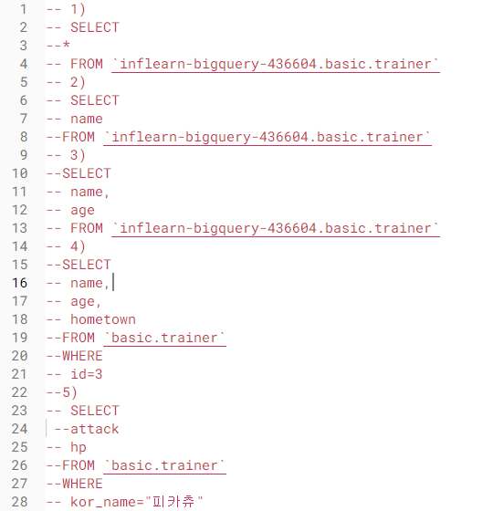
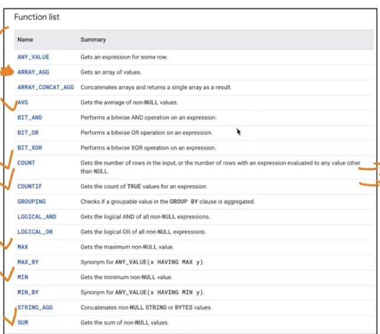

# 2주차 과제
# 2.3. 데이터 탐색 (SELECT, FROM, WHERE)
## - SQL 쿼리 구조 
 SELECT

Col1 AS new_name

Col2

Col3

FROM Dataset. Table : 어떤 테이블에서 데이터를 확인?

WHERE : 만약 원하는 조건이 있다면 어떤 조건인가?

Col1 = 1 : 조건문

### 포켓몬 데이터로 예시
 SELECT

* : 모든 칼럼 출력

FROM basic. pocketmon 

WHERE 

 Type1= “Fire”

+)
 SELECT
* EXCEPT : 제외할 컬럼

# 2.4. SELECT 연습문제

# 2.5. 집계 (GROUP BY+HAVING+SUM/COUNT)
## 1. 집계와 그룹화 : 그룹화해서 계산
### - 집계 : GROUP BY
- 같은 값끼리 모아서 그룹화한다
 ex. 색상을 기준으로 모은다
- 특정 칼럼을 기준으로 모으면서 다른 칼럼에선 집계 가능 ( 합, 평균, MAX, MIN 등)

### - SQL로 표현
SELECT

 집계할 칼럼1,

 집계 함수( COUNT, MAX, MIN 등)

FROM Table

GROUP BY

 집계할_칼럼

* 집계할 컬럼을 SELECT에 명시하고 그 컬럼을 꼭 GROUP BY에 작성하기

### - 집계함수 종류

### DISTINCT : 고유값을 알고 싶은 경우
### 활용 포인트
 - 일자별 집계, 연령대별 집계, 특정 타입별 집계, 앱 화면별 집계

## 2. HAVING : GROUP BY 후 조건을 설정하고 싶은 경우 
 SELECT 

컬럼1, 컬럼2,

COUNT (컬럼1) AS col1_count

FROM <table>

GROUP BY 칼럼1, 칼럼2

HAVING

 Col1_count>3 

## 3. 서브 쿼리
 - SELECT 문 안에 존재하는 SELECT 쿼리
 - FROM 절에 또 다른 SELECT 문을 넣을 수 있음
 - 괄호로 묶어서 사용
* 서브 쿼리 작성하고 서브 쿼리 바깥에서 WHERE 조건 설정
 = 서브 쿼리에서 HAVING으로 하는 것

## 4. ORDER BY : 정렬하기
SELECT

 Col

FROM
ORDER BY <칼럼> <순서>

순서 : DESC (내림차순), OSC(오름차순-디폴트)

-맨 마지막에 작성

## 5. 출력 개수 제한하기 : LIMIT
 - 쿼리문의 결과 ROW수를 제한하고 싶은 경우 사용
 
SELECT

 Col

FROM table

LIMIT 10
