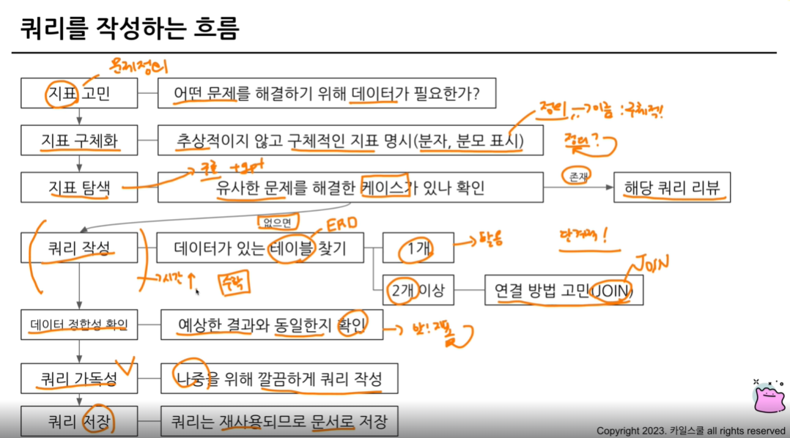

# 연습문제
- 테이블
- 조건
- 컬럼
- 집계
## 1번. type 2가 없는 포켓몬의 수 쿼리 작성

~~~
- 조건 : type 2가 없는
- type 2가 어떻게 생겼지? type 2d의 정의는 무엇이지?
- type 2 : NULL ; 0이랑 다르고 **랑도 다름 => 값이 없는 상태
- 연산자 IS NULL/ IS NOT NULL
- type2 = NULL은 안되나? 안됨 NULL은 다른 값과 직접 비교할 수 없음. NULL = NULL 거짓이 아니라 알 수 없
- 어떤 테이블? poketmon
- 어떤 집계? 포켓몬의 수 ==> COUNT
~~~
```sql
SELECT 
  COUNT(id) AS cnt
FROM basic.pokemon
WHERE
 type2 IS NULL
 OR type1 ='Fire'
```
- WHERE 절에서 여러 조건을 연결하고 싶은 경우 => AND 조건을 사용
- OR 조건 => () OR ()

## 2번. type 2 없는 포켓몬 type1과 그 수를 알려주는 쿼리 작성 (type 1 포켓몬 수가 큰 순으로 정렬)
~~~
테이블 : poketmon
조건 : type 2가 없는 포켓몬
정렬 : type 2가 없는 포켓몬
컬럼 : type 1 (정보)
집계 : 포켓몬 수 => COUNT
정렬 : type1의 포켓몬 수가 큰 순으로 정렬 => ORDER BY. 
~~~
```sql
SELECT
 type1,
 COUNT(id) AS poketmon_cnt
FROM basic. poketmon
WHERE
 type2 IS NULL
GROUP BY
 type1
ORDER BY
 poketmon_cnt DESC
```
- 큰 것부터 작은 것으로 => 내림차순(DESC)=> ORDER BY 포켓몬 수  DESC

- 집계함수는 GROUP BY와 같이 다님. 집계하는 기준(컬럼)이 없으면 COUNT만 쓸 수 있으나, 집계하는 기준이 있다면 그 기준 컬럼을 GROUP BY에 써줘야 함

## 3번. type2 상관없이 type1의 포켓몬 수 알 수 있는 쿼리 작성

```sql
SELECT
 type1,
 COUNT(id) AS poketmon_cnt,
 COUNT(DISTINCT id) AS poketmon_cnt2
FROM basic.poketmon
GROUP BY
 type1
```
- DISTINCT ; 고유한(uique) 값만 보고 싶을 떄 사용
 - COUNT(id)=COUNT(DISTINCT id); id 설계 시 중복이 없게 설계함 그래서 두 개의 결과가 동일

 ## 4번. 전설 여부에 따른 포켓몬을 알 수 있는 쿼리 작성
 
 ```sql
SELECT
 is_legendary,
 COUNT(id) AS poketmon_cnt
FROM basic.poketmon
GROUP BY
 is_legendary
```
 - GROUP BY : is_legendary 같이 긴 컬럼은 숫자로 대체
 - ex. GROUP BY 1 => SELECT의 첫 컬럼을 의미
 - ORDER BY에도 사용가능
 - 1,2  => 쿼리를 빠르게 작성하고 결과를 보는 과정에서만 사용. 명확하게 컬럼 명시해주는 것이 좋음(가독)

## 5번. 동명이인

 ```sql
SELECT
 name,
 COUNT(name) AS trainer_cnt
FROM basic.poketmon
GROUP BY
 name
```
 ```sql
SELECT
 *
FROM (
 SELECT
 name,
 COUNT(name) AS trainer_cnt
FROM basic.poketmon
GROUP BY
 name
)
WHERE
 trainer_cnt >=2
```
- HAVING ; 집계 후 조건, GROUP BY와 함꼐 집계결과에 조건을 설정하고 싶은 경우
- WHERE ; GROUP BY와 함께 집계 결과에 조건을 설정하고 싶은 경우
- 서브쿼리 : 쿼리문을 한번 감싸서 다른 쿼리문에 사용할 수 있음

## 6번. trainer 테이블에서 'Iris' 트레이너의 정보를 알 수 있는 쿼리 작성

 ```sql
SELECT
 *
FROM basic.trainer
WHERE
 name = 'Iris'
```

## 7번. + Whitney & Cynthia
 ```sql
SELECT
 *
FROM basic.trainer
WHERE
 (name = 'Iris')
 OR (name = "Cynthia")
 OR (name ="Whitney") 
```
- OR 조건으로 쓰는 것이 너무 길다면 => IN
- IN : name에 괄호 안의 Value가 있는 Row만 추출
 
 ```sql
SELECT
 *
FROM basic.trainer
WHERE
 name IN ('Iris', "Cynthia","Whitney") 
```

## 8번. 전체 포켓몬 수

 ```sql
SELECT
 COUNT(id) AS poketmon_cnt
FROM basic.trainer
```

- unrecognized name : 컬럼이름에 오타일 가능성이있음

## 9번. 세대별 포켓몬 수 

 ```sql
SELECT
 generation, 
 COUNT(id) AS poketmon_cnt
FROM basic.trainer
GROUP BY
 generation
```

## 10번. type2가 존제하는 포켓몬의 수

 ```sql
SELECT
 COUNT(id) AS poketmon_cnt
FROM basic.poketmon
WHERE
 type2 IS NOT NULL
```

## 11번. type2가 있는 포켓몬 중에 제일 많은 type 1

 ```sql
SELECT
 type1, 
 COUNT(id) AS poketmon_cnt
FROM basic.poketmon
WHERE
 type2 IS NOT NULL
ORDER BY
 poketmon_cnt DESC
LIMIT 1
```
- LIMIT 1: 첫 번째 행만 남긴다

## 12번. 단일 타입 포켓몬 중 가장 많은 type1

 ```sql
SELECT
 type1, 
 COUNT(id) AS poketmon_cnt
FROM basic.poketmon
WHERE
 type2 IS NOT NULL
GROUP BY 
 type1
ORDER BY
 poketmon_cnt DESC
LIMIT 1
```
## 13번. 포켓몬 이름에 "파"가 들어가는 포켓몬

 ```sql
SELECT
 kor_name
FROM basic.poketmon
WHERE
 kor_name LIKE "%파%"
 ```
 - 컬럼 LIKE "특정단어%"에서 % 는 앞 뒤 다 붙을 수 있음
 - "%파" : 파로 끝나는 단어, "파% : 파로 시작하는 단어,  "%파%" : 파가 들어가는 단어
 - 문자열 칼람에서 특정 단어가 포함되어 있는지 알고 싶은 경우 LIKE사용

## 14번. 뱃지가 6개 이상인 트레이너
 ```sql
SELECT
 COUNT (id) AS trainer_cnt
FROM basic.trainer
WHERE
 badge_count >=6
 ```

 ## 15번. 보유한 포켓몬이 가장 많은 트레이너
  ```sql
SELECT
 trainer_id
 COUNT (poketmon_id) AS poketmon_cnt
 COUNT (DISTINCT poketmon_id) AS poketmon_cnt
FROM basic.trainer_poketmon
GROUP BY
 trainer_id
 ```
 - DISTINCT로 중복확인

 ## 16번. 포켓몬을 많이 풀어준 트레이너
   ```sql
SELECT
 trainer_id
 COUNT (poketmon_id) AS poketmon_cnt
FROM basic.trainer_poketmon
WHERE
 status = "Released"
GROUP BY
 trainer_id
ORDER BY
 poketmon_cnt DESC
LIMIT 1
 ```

-많이 풀어준 -> COUNT /ORDER BY/ LIMIT

## 17번. 풀어준 포켓몬 비율이 20%가 넘는 트레이너

   ```sql
SELECT
 trainer_id,
 COUNTIF(status= "Released") AS released_cnt
 COUNT(poketmon_id) AS poketmon_cnt
 COUNTIF(status= "Released")/COUNT(poketmon_id) AS released_ratio
FROM basic.trainer_poketmon
GROUP BY
 trainer_id
HAVING
 released_ratio>=0.2
 ```

 - COUNTIF=COUNT+WHERE 
 - HAVING ; 집계 후 조건

 ## 정리. 
 ~~~
 단일 자료의 데이터를 탐색하는 법

 - 조건(필터링) : WHERE+FROM/ HAVING/ 서브쿼리
 - 추출 : SELECT
 - 변환
 - 요약(집계) : GROUP BY/ GROUP BY ALL
  +) AVG/ COUNT/ COUNTIF/ SUM/ MAX/ MIN
  +) 정렬 : ORDER BY (DESC), LIMIT
  ~~~

# SQL 쿼리 잘 작성하기, 쿼리 작성 템플릿 및 오류를 잘 디버깅하기

## 1. SQL 쿼리 작성 흐름


## 2. 쿼리 작성 템플릿과 생산성 도구

~~~
템플릿 ;
# 쿼리 작성 목표, 확인할 지표 : 정의
# 쿼리 계산 방법
# 데이터의 기간
# 사용할 테이블
# Join KEY
# 데이터 특징

but 템플릿을 사용하는 것이 힘듦 -> 생산성 도구 사용 
* Espanso : 특정 단어가 감지되면 정의된 것으로 바꿔줌
