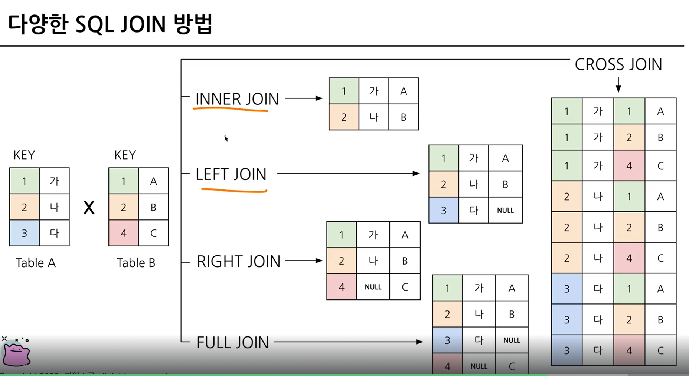
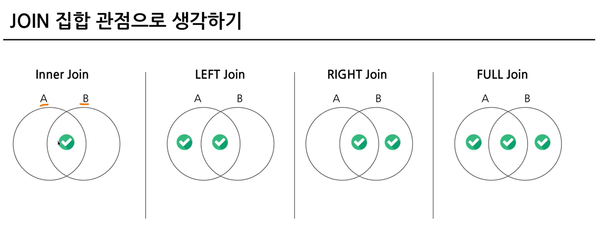
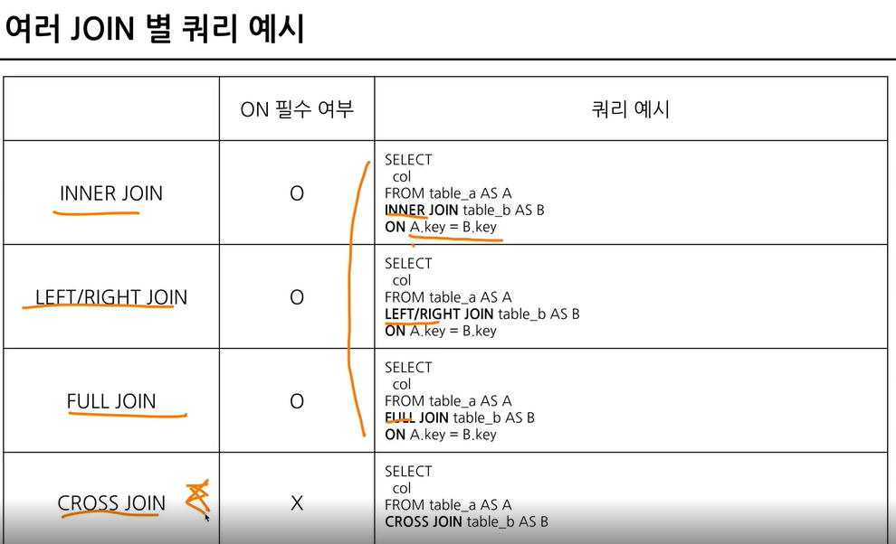

# 5-1. Intro
# 5-2. JOIN 이해하기
- SQL JOIN : 서로 다른 데이터 테이블을 연결하는 것 (**2 테이블 -> 공통 key -> 테이블 우측 붙임, 컬럼 추가** )
~~~
트레이너가 포획한 포켓몬 기준으로 트레이너 데이터를 연결하기(JOIN) 연결할 수 있는 Key=trainer_id, id

-관계형 데이터베이스 (RDBMS) 설계시 정규화 과정을 거침
-정규화는 중복을 최소화하게 데이터를 구조화
-데이터를 다양한 table에 저장해서 필요할 때 JOIN해서 사용
-데이터를 분석하는 관점에선 미리 JOIN 되어 있는 것이 좋을 수 있지만, 개발 관점에서는 분리되어 있는 것이 좋음
-대신 데이터 웨어하우스에서 JOIN+필요한 연산을 해서 "데이터마트"를 만들어서 활용
~~~

# 5-3. 다양한 SQL JOIN 방법
```sql
(INNER) JOIN : 두 테이블의 공통 요소만 연결
LEFT/RIGHT (OUTER) JOIN : 왼쪽/오른쪽 테이블 기준으로 연결
FULL (OUTER) JOIN : 양쪽 기준으로 연결
CROSS JOIN : 두 테이블의 각각의 요소를 곱하기 
```




# 5-4. JOIN 쿼리 작성하기
- SQL JOIN 쿼리 작성 흐름
~~~
1) 테이블 확인 : 테이블에 저장된 데이터, 컬럼 확인
2) 기준 테이블 정의 : 가장 많이 참고할 기준(base) 테이블 정의
3) JOIN key 찾기 : 여러 테이블과 연결할 key(on) 정리
4) 결과 예상하기 : 결과 테이블을 예상해서 손, 엑셀로 작성( 일종의 정답지 역할)
5) 쿼리 작성/검증 : 예상한 결과와 동일한 결과가 나오는지 확인
~~~

```sql
SELECT
 A.col1,
 A.col2,
 B.col11,
 B.col12
FROM table1 AS A
LEFT JOIN table2 AS B
ON A.key = B.key #Alias를 사용할 수 있음
```


```sql
SELECT
 tp.*
 t.*
 p.*
FROM basic.trainer_pokemon AS tp
LEFT JOIN basic.trainer AS t
ON tp.trainer_id = t.id
LEFT JOIN basic.pokemon AS p
ON tp.pokemon_id = p.id
```

# 5-4. JOIN을 처음 공부할 때 헷갈렸던 부분
~~~
1) 여러 join 중 어떤 것을 사용해야 할까?
교집합 : INNER
모두 다 조합 : CROSS
그게 아니라면 LEFT 혹은 RIGHT : LEFT를 추천. 하나를 계속 활용하는 것을 추천

2) 어떤 table을 왼쪽에 두고, 어떤 table이 오른쪽에 가야할까?
기준이 되는 table을 왼쪽에 두기
기준에는 기준값이 존재하고 우측에는 데이터를 계속 추가

3) 여러 table을 연결할 수 있는 걸까?
가능 but 너무 많이 하는 것은 추천 x

4) 컬럼은 모두 다 선택해야 할까?
무엇을 하고자 하냐에 따라 다름
join이 잘 되었나 확인하기 위해 처음에는 많은 컬럼을 선택해도 괜찮으나 사용하지 않을 컬럼은 선택하지 않는 것이 bigquery에서 비용을 줄일 수 있음
id같은 값은 unique한지 확인하기 위해 자주 사용되므로 id는 자주 사용한는 편

5) null이 뭘까?
값이 없음 알 수 없음 0이나 공백과 다르게 값이 아예 없는 것. join에서는 연결할 값이 없는 경우 나타남
~~~
# 5-5/ 5-6 연습문제
# 5-7. 정리
- JOIN : 여러 테이블 연결할 때 사용하는 문법
- KEY : 공통적으로 가지고 있는 컬럼

