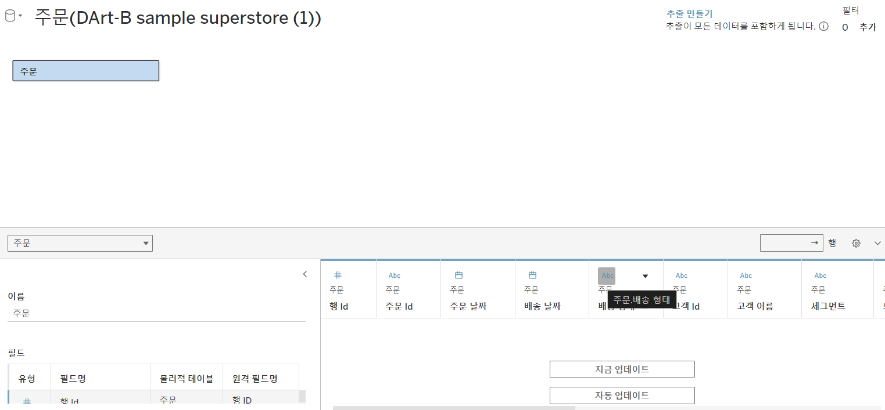

# First Study Week

- 1강: [태블로설치](#1강-태블로설치)

- 2강: [데이터연결](#2강-데이터연결)

- 3강: [데이터연결과 데이터유형](#3강-데이터연결과-데이터유형)

- 4강: [데이터결합과 관계](#4강-데이터결합과-관계)

- 5강 : [데이터결합과 조인](#5-데이터결합과-조인)

- 6강: [데이터결합 혼합](#6강-데이터결합-혼합)

- 7강: [데이터결합과 유니온](#7강-데이터-결합과-유니온)

- 8강: [라이브 및 추출](#8강-라이브-및-추출)

- 9강: [데이터형식](#9강-데이터형식)

- 문제1 : [문제1](#문제-1)

- 문제2 : [문제2](#문제-2)

- 참고자료 : [참고자료](#참고-자료)


## Study Schedule

| 강의 범위     | 강의 이수 여부 | 링크                                                                                                        |
|--------------|---------|-----------------------------------------------------------------------------------------------------------|
| 1~9강        |  ✅      | [링크](https://youtu.be/3ovkUe-TP1w?si=CRjj99Qm300unSWt)       |
| 10~19강      | 🍽️      | [링크](https://www.youtube.com/watch?v=AXkaUrJs-Ko&list=PL87tgIIryGsa5vdz6MsaOEF8PK-YqK3fz&index=75)       |
| 20~29강      | 🍽️      | [링크](https://www.youtube.com/watch?v=AXkaUrJs-Ko&list=PL87tgIIryGsa5vdz6MsaOEF8PK-YqK3fz&index=65)       |
| 30~39강      | 🍽️      | [링크](https://www.youtube.com/watch?v=e6J0Ljd6h44&list=PL87tgIIryGsa5vdz6MsaOEF8PK-YqK3fz&index=55)       |
| 40~49강      | 🍽️      | [링크](https://www.youtube.com/watch?v=AXkaUrJs-Ko&list=PL87tgIIryGsa5vdz6MsaOEF8PK-YqK3fz&index=45)       |
| 50~59강      | 🍽️      | [링크](https://www.youtube.com/watch?v=AXkaUrJs-Ko&list=PL87tgIIryGsa5vdz6MsaOEF8PK-YqK3fz&index=35)       |
| 60~69강      | 🍽️      | [링크](https://www.youtube.com/watch?v=AXkaUrJs-Ko&list=PL87tgIIryGsa5vdz6MsaOEF8PK-YqK3fz&index=25)       |
| 70~79강      | 🍽️      | [링크](https://www.youtube.com/watch?v=AXkaUrJs-Ko&list=PL87tgIIryGsa5vdz6MsaOEF8PK-YqK3fz&index=15)       |
| 80~89강      | 🍽️      | [링크](https://www.youtube.com/watch?v=AXkaUrJs-Ko&list=PL87tgIIryGsa5vdz6MsaOEF8PK-YqK3fz&index=5)        |


<!-- 여기까진 그대로 둬 주세요-->


## 1강. 태블로설치


 태블로 Desktop은 유료 혹은 사용자 인증이 되어야 하므로, 사용 경험이 없으시다면 우선 Tableau Public으로 학습하는 것을 권장드립니다. 


## 2강. 태블로연결


> **🧞‍♀️ 데이터 해석기는 어떤 경우 사용하나요?**

```
병합된 셀, 메모, 바닥글 빈 셀 등을 감지하고 이를 무시하여 데이터 집합의 실제 필드와 값을 식별할 수 있게 하는 기능이다. 데이터 관리시 태블로가 읽기 쉽도록 해야하나 그렇지 않은 경우 이 데이터 해석기 기능을 활용할 수 있다.
```


> **🧞‍♀️ 깃허브 assignment 폴더의 DArt-B Sample Store.xls 파일을 다운받고 시트 중 '주문' 시트를 불러와주세요.**




## 3강. 데이터연결과 데이터 유형


> **🧞‍♀️ 라이브와 추출의 차이가 무엇인가요? 어떤 경우 사용하나요?**


```
기본값으로 설정된 라이브는 태블로가 데이터에 직접 연결하는 형태로 데이터원본에 변화가 생기면 시트에서 작업한 내용에 바로 영향을 미치게 된다.
데이터에 직접 연결되는 만큼 데이터의 양이 많아지면 처리 속도 및 성능이 저하될 수 있다.
추출은 현재 데이터 원본의 상태를 hyper 형태로 저장하는 것이며 데블로 데스크탑에서는 추출 파일로 작업을 하게 된다. 오프라인 상태에서도 추출파일을 가지고 있다면 작업이 가능하며 라이브에 비해 속도가 빠르다는 장점이 있다. 원본이 변경된 경우에는 새로고침을 통해 추출데이터를 최신화할 수 있다. 
```


## 4강. 데이터결합과 관계
- 태블로는 관계와 조인이라는 두 가지 방법으로 데이터를 결합할 수 있다.
- 두 가지 방법 모두 서로 다른 테이블의 데이터를 결합하지만 관계로 결합된 데이터는 조인으로 결합된 데이터보다 동적이고 유연하게 연결된다는 점에서 차이가 있다. 
- 관계로 결합할 때 원본 데이터를 조금 더 독립적으로 활용할 수 있다는 것이다.


> **🧞‍♀️ 어떤 경우에 관계를, 어떤 경우에 조인을 사용하나요?**

```
관계로 데이터를 결합하기 위해서는 결합하려는 데이터 간의 유형이 동일해야한다. 관계로 결합된 테이블은 각각 독립적으로 데이터 원본을 활용할 수 있다. 조인에서 발생할 수 있는데 데이터 중복 및 필터링 문제를 방지하고 유연하게 데이터를 결합할 수 있게 한다. 원래 테이블의 세부 수준을 유지할 수 있게 한다. 관계로 결합 권장 그러나 제어 혹은 의도적인 필터링, 복제를 위해 조인으로 데이터를 결합하는 경우가 있다.
```


## 5강. 데이터결합과 조인
- inner: 두 테이블에서 모두 일치하는 항목만을 포함(테이블 간 데이터가 일치하지 않으면 그 값은 삭제)
- left/right: 한쪽 테이블의 모든 값과 반대쪽 테이블의 일치 항목만을 포함. 만약 left 조인에서 왼쪽 테이블의 값이 오른쪽 테이블에 존재하지 않을 경우 그 값이 null로 표시
- outer: 두 테이블의 모든 값을 완전히 포함 한쪽 값이 다른 테이블에 일치하지 않을 경우에도 데이터가 null로 표시

주문 중 '반품된' 주문만을 가지고 분석을 진행하려고 합니다.

> **🧞‍♀️ 해당 목적 달성을 위해서 Sample store 데이터셋의 어떤 시트를 조인(혹은 릴레이션)해야 할까요? 조인키는 무엇인지, (inner, outer, left, right) 조인 유형은 무엇일지 논의해주세요.**

데이터를 조인한 데이터 원본 창의 캡쳐를 첨부해주세요.
몇 개의 주문이 반품되었다고 표시되나요?


주문한 것 중에 반품된 것을 찾는 것이니까 innerjoin이 적합하다. 3027개의 주문이 반품되었음을 알 수 있다. 

## 6강. 데이터결합 혼합

- 실제로 결합하지는 않음. 
- 각 데이터 원본을 독립적으로 결과를 집계한 후에 한 시트에서 데이터를 시각화할 수 있도록 하는 방법.
- 여러 데이터 원본에 혼합된 결과만을 화면에 나타내는 것

## 7강. 데이터 결합과 유니온

앞서 설명한 것들은 데이터에 열을 추가해 결합하는 것이지만 유니온은 한 테이블의 행을 다른 테이블에 추가하여 결합하는 방법이다.

> **🧞‍♀️ 유니온을 사용하기 위한 전제 조건은 무엇인가요?**
-각 테이블의 필드 수가 같고 관련 필드의 필드 이름과 데이터 유형이 일치해야 한다.


## 8강. 라이브와 추출

- 라이브 :
 기본값으로 설정된 라이브는 태블로가 데이터에 직접 연결하는 형태로 데이터원본에 변화가 생기면 시트에서 작업한 내용에 바로 영향을 미치게 된다.데이터에 직접 연결되는 만큼 데이터의 양이 많아지면 처리 속도 및 성능이 저하될 수 있다.
- 추출 :
추출은 현재 데이터 원본의 상태를 hyper 형태로 저장하는 것이며 데블로 데스크탑에서는 추출 파일로 작업을 하게 된다. 오프라인 상태에서도 추출파일을 가지고 있다면 작업이 가능하며 라이브에 비해 속도가 빠르다는 장점이 있다. 원본이 변경된 경우에는 새로고침을 통해 추출데이터를 최신화할 수 있다.  

> **🧞‍♀️ 라이브와 추출 방법의 차이가 무엇인가요? 어떤 경우에 추출을 사용하면 좋을까요?**

시간 데이터 분석이 필요하거나 데이터가 빈번하게 변경되는 경우 라이브 연결이 적합하고 성능이 중요하거나 데이터가 크고, 자주 업데이트되지 않으며 오프라인에서도 작업해야 하는 경우에는 추출을 사용하는 것이 좋다.


**참고자료 : 온프레미스 데이터란?**

기업이나 조직이 자체적으로 보유한 물리적 서버나 데이터 센터 내에서 직접 관리하는 데이터로, 조직 내의 하나 이상 서버에서 통제됩니다. 본 서버들은 기업의 데이터센터나 물리적 위치에 설치되어 있으며, 네트워크를 통해 해당 데이터에 접근하고 관리할 수 있습니다.


## 9강. 데이터형식

실수 정수형 : #, 날짜 시간 : 달력 아이콘, 문자열 : abc, bool: true/false 아이콘, 지리적 역할: 지구본 모양(위도 경도) 

## 문제 1.

용웅이는 아래 사진과 같이 2024년 3월부터 7월까지의 지하철 승하차 이용객 데이터를 가지고 있습니다. 월별로 데이터셋이 나누어진 상태며, 용웅이는 해당 데이터셋 5개 모두를 한 번에 시각화하려 합니다. 필드 값(컬럼)의 이름, 데이터 유형, 개수는 모두 같습니다.


 이때, '조인, 관계, 혼합, 유니온' 중 본 목적에 적합한 결합 방법은 무엇인가요? 하나씩 드래그하지 않고, 와일드카드를 이용해 모든 데이터를 빠르게 결합해보세요.

```
유니온이 적합한 방법이다. 와일드 카드에 'C*'을 입력해주면 'C'로 시작하는 테이블들을 한 번에 결합할 수 있다.
```

## 문제 2.

상원이는 태블로를 사용하여 회사의 매출 데이터를 시각화하려고 합니다. 태블로에서는 데이터를 연결하는 두 가지 방식인 **라이브 연결과 추출 연결**이 있습니다. 두 방식 중 어떤 것을 사용할지 고민 중입니다.

다음의 일상생활 사례를 바탕으로, 어떤 상황에서 라이브 연결이 적합하고, 어떤 상황에서 추출 연결이 더 적합한지 설명하세요.

1. 사례 1: 실시간 주식 시세 확인
주식 거래를 하고 있는 수금의왕 상원이는 주식 시세가 매 순간 변동하는 실시간 데이터를 필요로 합니다. 이 데이터를 기반으로 빠르게 결정을 내려야 합니다.


```
라이브 연결이 적합하다. 라이브는 데이터원본에 변화가 생기면 시트에서 작업한 내용에 바로 영향을 미치게 되기에 매 순간 변동하는 실시간 데이터를 보기 쉽다.
```


2. 사례 2: 상원이는 저번 주 제주도로 여행을 갔었어요. 비행 중에 예산 계획을 세우려 하는데, 인터넷 연결이 불안정할 것 같아요. 여행 전 미리 예산 데이터를 다운로드해서 오프라인에서도 사용할 수 있으면 좋겠습니다.

```
추출 연결이 적합하다. 오프라인 상태에서도 추출파일을 가지고 있다면 작업이 가능하기 때문이다. 
```

## 참고 자료

데이터 분석을 하다보면 지역별로 경향을 알아보고자 할 때가 많습니다.

태블로에서는 시/도, 시군구명을 칼럼으로 가지고 있고, 그걸 지리적 위치로 바꿔주면 지도에서 위치를 인식하는데요.
하지만 읍면동(행정동) 단위까지 인식하지는 못합니다.

그럼 어떻게 읍면동 단위까지 세분화하여 표기할 수 있을까요?

이때 방금 배운 데이터 릴레이션 혹은 조인을 사용합니다.
맵 그래프는 지금 배울 부분은 아니지만, 데이터 병합에 관련된 부분이기에 필요하신 분들을 위해 아래 링크를 걸어두겠습니다.


바로 읍면동의 경계를 가지고 있는 shp, geojson 등 공간파일을 원본데이터와 머지하는 것입니다.

링크: https://subinze.tistory.com/m/2