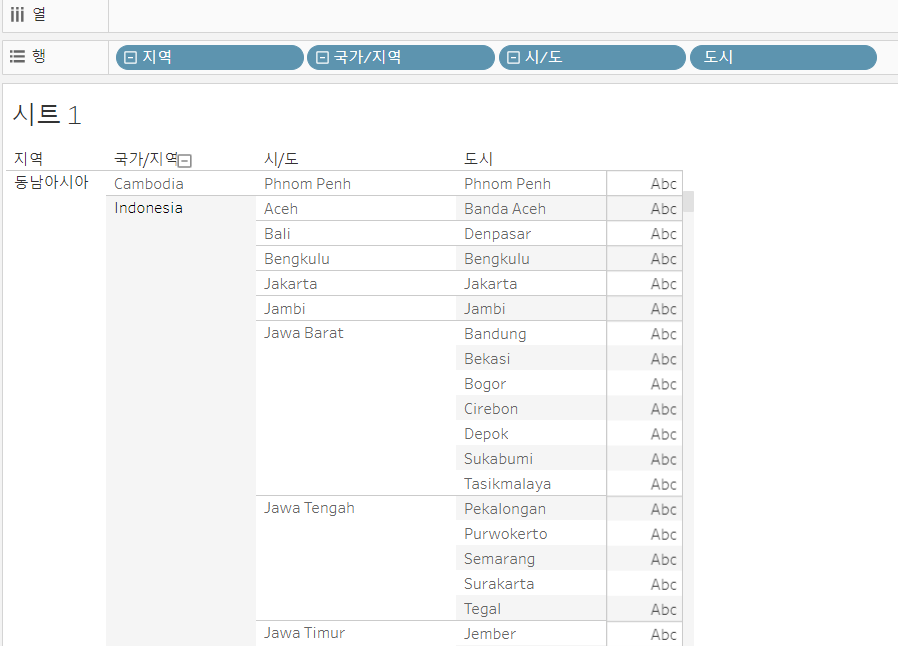
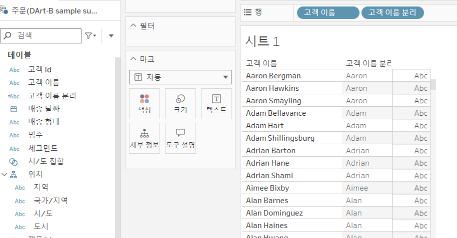
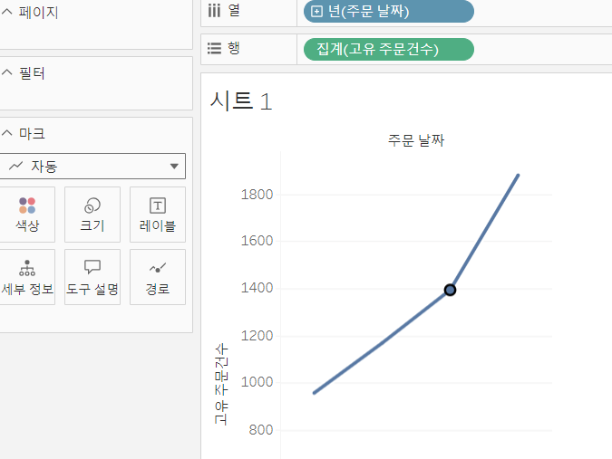
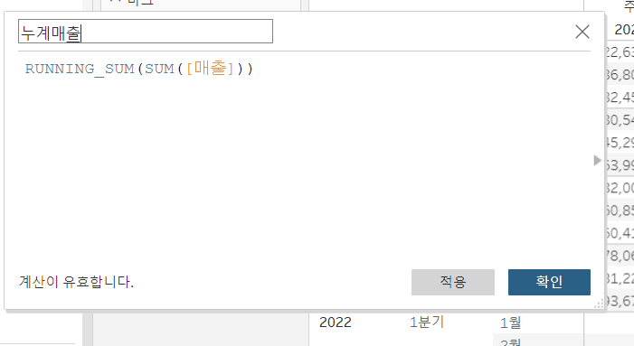
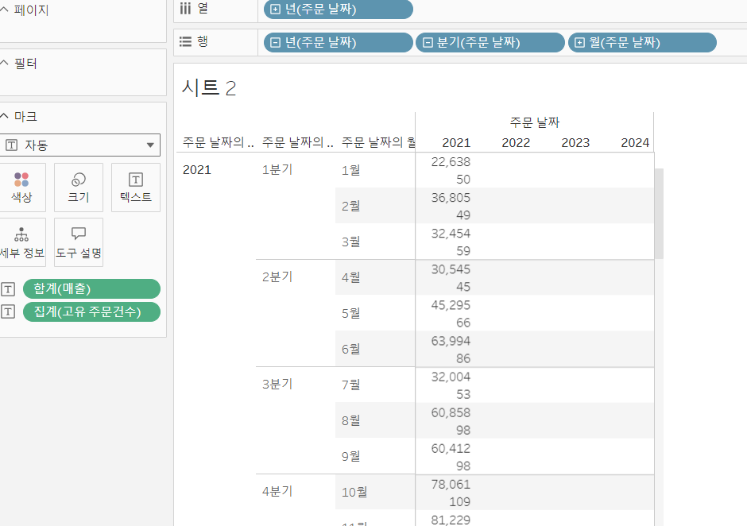
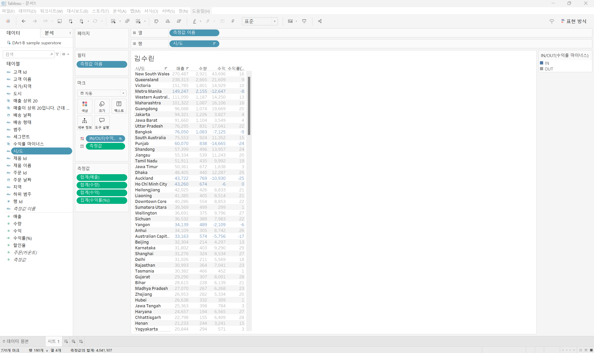

# Fourth Study Week

- 30강: [계층](#30-계층)

- 31강: [집합](#31-집합)

- 32강: [결합집합](#32-결합집합)

- 33강: [계산된 필드](#33-계산된-필드)

- 34강: [행수준계산](#34-행수준계산)

- 35강: [집계계산](#35-집계계산)

- 36강: [테이블계산](#36-테이블계산)

- 37강: [퀵테이블계산(1)](#37-퀵테이블계산1)

- 38강: [퀵테이블계산(2)](#38-퀵테이블계산2)

- [문제1](#문제-1)

- [문제2](#문제-2)

- [문제3](#문제-3)

## Study Schedule

| 강의 범위     | 강의 이수 여부 | 링크                                                                                                        |
|--------------|---------|-----------------------------------------------------------------------------------------------------------|
| 1~9강        |  ✅      | [링크](https://www.youtube.com/watch?v=AXkaUrJs-Ko&list=PL87tgIIryGsa5vdz6MsaOEF8PK-YqK3fz&index=84)       |
| 10~19강      | ✅      | [링크](https://www.youtube.com/watch?v=AXkaUrJs-Ko&list=PL87tgIIryGsa5vdz6MsaOEF8PK-YqK3fz&index=75)       |
| 20~29강      | ✅      | [링크](https://www.youtube.com/watch?v=AXkaUrJs-Ko&list=PL87tgIIryGsa5vdz6MsaOEF8PK-YqK3fz&index=65)       |
| 30~38강      | ✅      | [링크](https://youtu.be/e6J0Ljd6h44?si=nhGbB7GsdOCqj15f)       |
| 39~49강      | 🍽️      | [링크](https://www.youtube.com/watch?v=AXkaUrJs-Ko&list=PL87tgIIryGsa5vdz6MsaOEF8PK-YqK3fz&index=45)       |
| 50~59강      | 🍽️      | [링크](https://www.youtube.com/watch?v=AXkaUrJs-Ko&list=PL87tgIIryGsa5vdz6MsaOEF8PK-YqK3fz&index=35)       |
| 60~69강      | 🍽️      | [링크](https://www.youtube.com/watch?v=AXkaUrJs-Ko&list=PL87tgIIryGsa5vdz6MsaOEF8PK-YqK3fz&index=25)       |
| 70~79강      | 🍽️      | [링크](https://www.youtube.com/watch?v=AXkaUrJs-Ko&list=PL87tgIIryGsa5vdz6MsaOEF8PK-YqK3fz&index=15)       |
| 80~89강      | 🍽️      | [링크](https://www.youtube.com/watch?v=AXkaUrJs-Ko&list=PL87tgIIryGsa5vdz6MsaOEF8PK-YqK3fz&index=5)        |

<!-- 여기까진 그대로 둬 주세요-->

> **🧞‍♀️ 오늘의 스터디는 지니와 함께합니다.**


## 30. 계층
~~~
- 계층은 뷰에서 데이터를 드릴 다운해 값을 세부적으로 찾을 때 유용한 방법
- 태블로는 날짜 데이터는 자동으로 계층 생성
- 계층 만들기 : 두 필드 선택 -> 마우스 우클릭 계층에서 계층 만들기 -> 계층 이름 입력 -> 나머지 필드 계층으로 드래그
~~~

## 31. 집합
~~~
수익을 많이 낸 상위 10개 도시

- 시도 필드에서 마우스 우클릭 -> 만들기 필터에서 집합 선택 -> 설정에서 상위 탭 -> 집합 이름 적기 -> 필드 기준 상위로 선택
~~~

## 32. 결합집합

두 가지 조건을 적용하고 싶을 때 결합된 집합 사용


## 33. 계산된 필드

계산된 필드: 데이터 원본에 있는 필드를 활용하여 새로운 필드를 만드는 기능, 기존 데이터 이외에 추가로 계산해야할 데이터가 추가적으로 필요한 경우에 계산될 필드 만들어 사용

~~~
만드는 방법
1. ㄷㅔ이터 패널
2. 분석탭
3. 마우스 우클릭

필드를 입력하는 방법
1. 해당 필드 드래그 앤 드랍
2. 입력창에 필드 이름 입력
//<-주석
~~~

## 34. 행수준계산

~~~
1. 기본계산 : 데이터 원본에 대한 행수준 계산 OR 집계계산
2. 테이블 계산
3. LOD 표현식
~~~
행수준 실습

## 35. 집계계산

~~~
태블로는 필드 드래그 앤 드랍하면 자동으로 SUM함수로 반영
-> 딴 함수로 고려보고 싶으면 필드 마우스 우클릭 -> 기본속성에 집계
계산된 필드에서는 드롭다운 메뉴를 통해 집계 목록 선택

**사용자가 집계 계산한 필드는 마우스 우클릭으로 변경 불가**

~~~


## 36. 테이블계산

뷰에서 보이는 기준을 따라서 계산
~~~
생성 방법
테이블 계산에서 계산된 필드 선택-> 드롭다운 메뉴에서 테이블 계싼 선택-> 계산 공간에 함수 적기-> 마크에 올려서 확인

변경방법
1. 마우스 우클릭으로 다음을 사용하여 계산 확인
~~~




## 37. 퀵테이블계산(1)

작동방식:
사용하고자 하는 필드 위에 마우스 우클릭 후 퀵테이블 계산 선택
~~~
계산유형
1) 누계
테이블을 복제하여 퀵테이블 계산에서 누계 선택. 삼각형 있으면 테이블 계산이 되었음을 의미. 이중축 적용하여 그래프 보기 편하게
2) 차이
측정값이 기준값과 어느정도 차이나는지 구하는 유형
3) 비율차이
측정값들 사이에 성장률 또는 % 차이를 표현
4) 구성비율
*옆에서 아래로 변경 : 순위 보여줌
*패널 아래로 계산 옵션: 해당 지역 범주 고정 비율 합이 100%
5) 백분위수
~~~

## 38. 퀵테이블계산(2)

1) 이동평균 : 이전의 값부터 현재까지 값에 대한 평균을 낼 때 주로 사용하며 주식데이터에서 많이 활용
2) YTD : 특정시점을 기준으로 연도부터 그 시점까지 총계. 누계와 같은 개념이지만 연도 보다 하위 필드인 분기나 월이 있어야 사용가능
3) 통합성장률 : 특정기간 동안 누적된 성장률
4) YTD 성장률 : YTD 성장률은 Year-To-Date의 약자로, 특정 해의 시작부터 현재 시점까지의 성장을 측정하는 지표입.이는 올해 들어서 얼마나 성장했는지를 나타내는 것으로, 주로 매출, 수익, 투자 성과 등을 평가하는 데 사용

## 문제 1.

규석이는 이제껏 매출을 올리는 데에 힘썼었지만, 왠지 모르게 주머니에 들어오는 돈이 없어 속상합니다. 

그래서 매출이 상위 20곳에 속하지만, 수익률(%)이 마이너스인 시/도를 확인하려고 합니다.

> 수익률은 SUM([수익]) / SUM([매출])로 정의합니다.

어떤 집합을 만들었고, 어떤 결합을 하였는지를 중심으로 기술하고, 결과 자료를 첨부해주세요. 

(텍스트 표 형태이며, 색상으로 위 집합을 구분할 수 있게 만들어주세요.)

<!-- 아래 예시 이미지를 삭제하고, 직접 만든 시트 사진을 올려주세요. 시트의 이름은 본인 이름으로 기입해주세요-->


~~~
1. 수익률 정의
태블로에서 계산된 필드로 수익률을 정의
[수익률] = SUM([수익]) / SUM([매출])

2. 매출 상위 20곳을 집합으로 만들기
시/도별 매출 합산:
시/도 차원을 행(Row)에 추가하고, 매출을 값에 추가한 후 SUM([매출])을 계산
매출 상위 20곳 집합 만들기:
시/도 필드를 마우스 오른쪽 클릭한 후 "집합 만들기"를 선택
집합 설정 창에서, 상위 20곳을 선택하기 위해 상위 탭에서 "SUM([매출])"을 기준으로 상위 20개 항목을 선택
이 집합을 "상위 20 매출 시/도"라고 이름정의

3. 수익률이 마이너스인 시/도 집합 만들기
수익률 계산된 필드 적용:
계산된 필드인 [수익률]을 사용하여 수익률을 계산한 후, 수익률이 음수(마이너스)인 시/도를 필터링
"집합 만들기"를 선택 후 조건 탭에서 수익률이 0보다 작은 값을 선택합니다.
조건식: [수익률] < 0
이 집합을 "마이너스 수익률 시/도"라고 이름 정의
4. 두 집합의 결합
태블로에서 두 집합을 선택하고, 집합 결합을 통해 "상위 20 매출 시/도" AND "마이너스 수익률 시/도"로 교집합 생성

5. 텍스트 표와 색상 적용
행에는 시/도, 열에는 매출과 수익률을 추가
결합된 집합을 필터에 추가하여 해당 조건을 충족하는 시/도만 표시되도록 필터링
색상 적용: 수익률 필드를 마크 카드의 색상에 드래그한 후, 수익률 값이 음수일 때 빨간색, 양수일 때 파란색으로 설정합니다.
~~~

## 문제 2.
선희는 주문 Id별로 주문에서 배송까지에 걸리는 날짜 일수가 궁금했습니다. 
그래서 주문 ID별로 주문에서 배송까지 걸리는 일자를 '배송까지 걸린 일수'라는 계산된 필드로 만들고, 이를 마크에 올린 후 확인해보았습니다. 
이때, 계산된 필드의 식은 'DATEDIFF' 함수를 이용하였습니다.

배송까지 걸린 일수 계산을 위한 DATEDIFF 함수 수식을 적어주세요.

```
DATEDIFF('day', [주문 날짜], [배송 날짜])
```


그런데 위 그림처럼 '주문 날짜'와 '배송 날짜'를 함께 행에 올려 확인해보니, 주문날짜와 배송날짜의 차이가 '배송까지 걸린 일수'와 다릅니다.

ID-2021-11126을 보니, 11월 26일 배송에 11월 30일 배송이면 4일 차이인데, 12일이 걸렸다고 하네요. 왜 이런 문제가 생긴걸까요?

```
중복 주문 ID가 있을 경우 합산되어 위와 같은 문제가 발생할 수 있다.
```

그리고 이를 해결하기 위해서는 어떻게 해야 할까요?

```
필드를 차원값으로 변경하면 된다
```


## 문제 3.

다음은 Tableau의 다양한 계산을 사용할 수 있는 경우를 빈칸으로 두고 문제를 작성한 것입니다. 각 빈칸에 적합한 계산 유형을 채워보세요.

보기
> **누계, 차이, 비율 차이, 구성 비율, 순위, 백분위수, 이동 평균, YTD 총계, 통합 성장률, 전년 대비 성장률, YTD 성장률**

| 계산 유형               | 설명                                                                 | 사용 예시                                                                                          |
|-------------------------|----------------------------------------------------------------------|-----------------------------------------------------------------------------------------------------|
| 누계           | 데이터의 누적 합계를 계산                                             | 한 기업이 월별 매출 데이터를 누적하여 연간 매출 추이를 보고 싶을 때 사용                                      |
| 차이       | 연속 데이터 포인트 간의 차이를 계산                                    | 한 기업이 월별 매출 데이터에서 전월 대비 매출 증감량을 분석하고 싶은 경우                                        |
| 비율차이         | 연속 데이터 포인트 간의 비율 변화를 계산                               | 한 기업이 월별 매출 데이터에서 전월 대비 매출 증감률(%)을 분석하고 싶은 경우                                      |
|구성비율        | 전체에서 각 데이터 포인트의 비율을 계산                                | 한 기업이 전체 매출에서 각 제품군이 차지하는 비율을 보고 싶을 때 사용                                           |
|순위        | 데이터의 순위를 매깁니다                                              | 한 기업이 제품별 매출 데이터를 순위별로 정렬하여 상위 10개 제품을 분석하고 싶은 경우                              |
|백분위수    | 데이터의 백분위를 계산                                               | 한 기업이 고객별 구매 금액 데이터를 백분위수로 나누어 상위 25% 고객을 분석하고 싶은 경우                          |
| 이동평균         | 일정 기간의 평균을 계산                                               | 한 기업이 주간 매출 데이터에서 4주 이동 평균을 계산하여 트렌드를 분석하고 싶은 경우                              |
| YTD         | 연초부터 현재까지의 총계를 계산                                      | 한 기업이 월별 매출 데이터를 연초부터 현재까지 누적하여 연간 매출 목표 달성 여부를 분석하고 싶은 경우             |
|통합성장률           | 일정 기간 동안의 연평균 성장률을 계산                                  | 한 기업이 5년 간 매출 데이터를 바탕으로 연평균 성장률(CAGR)을 계산하고 싶은 경우                                  |
| 전년 대비 성장률          | 전년 동기간 대비 성장률을 계산                                        | 한 기업이 월별 매출 데이터에서 전년 동월 대비 매출 성장률을 분석하고 싶은 경우                                    |
|YTD 성장률        | 연초부터 현재까지의 성장률을 계산                                     | 한 기업이 올해 연초부터 현재까지의 매출이 전년 동기 대비 얼마나 성장했는지 분석하고 싶은 경우                     |

> 사용 예시를 참고하여 실제 경우처럼 생각하며 고민해보아요!