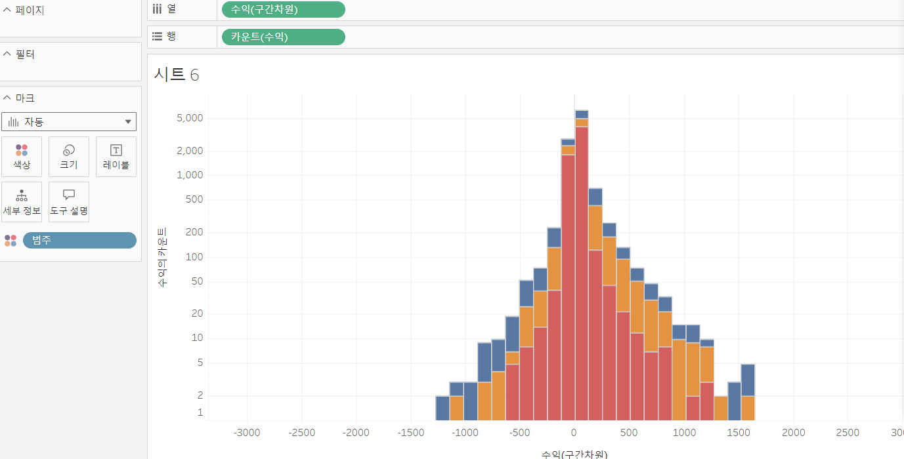
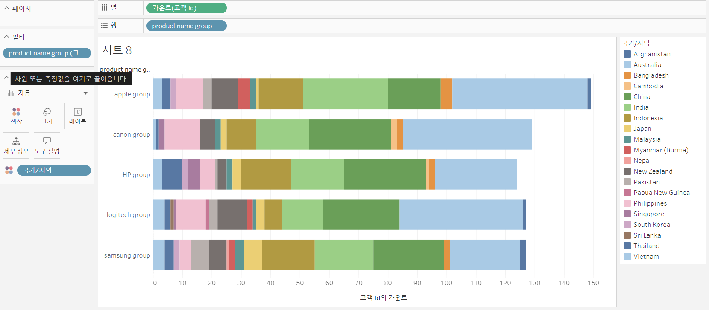

# Third Study Week

- 20강: [파이와 도넛차트](#20강-파이와-도넛차트)

- 21강: [워드와 버블차트](#21강-워드와-버블차트)

- 22강: [이중축과 결합축](#22강-이중축과-결합축)

- 23강: [분산형 차트](#23강-분산형-차트)

- 24강: [히스토그램](#24강-히스토그램)

- 25강: [박스플롯](#25강-박스플롯)

- 26강: [영역차트](#26강-영역차트)

- 27강: [간트차트](#27강-간트차트)

- 28강: [필터](#28강-필터)

- 29강: [그룹](#29강-그룹)


- 문제1 : [문제1](#문제1)

- 문제2 : [문제2](#문제2)

- 참고자료 : [참고자료](#참고-자료)


## Study Schedule

| 강의 범위     | 강의 이수 여부 | 링크                                                                                                        |
|--------------|---------|-----------------------------------------------------------------------------------------------------------|
| 1~9강        |  ✅      | [링크](https://youtu.be/3ovkUe-TP1w?si=CRjj99Qm300unSWt)       |
| 10~19강      | ✅      | [링크](https://www.youtube.com/watch?v=AXkaUrJs-Ko&list=PL87tgIIryGsa5vdz6MsaOEF8PK-YqK3fz&index=75)       |
| 20~29강      | ✅      | [링크](https://www.youtube.com/watch?v=Qcl4l6p-gHM)      |
| 30~39강      | 🍽️      | [링크](https://www.youtube.com/watch?v=e6J0Ljd6h44&list=PL87tgIIryGsa5vdz6MsaOEF8PK-YqK3fz&index=55)       |
| 40~49강      | 🍽️      | [링크](https://www.youtube.com/watch?v=AXkaUrJs-Ko&list=PL87tgIIryGsa5vdz6MsaOEF8PK-YqK3fz&index=45)       |
| 50~59강      | 🍽️      | [링크](https://www.youtube.com/watch?v=AXkaUrJs-Ko&list=PL87tgIIryGsa5vdz6MsaOEF8PK-YqK3fz&index=35)       |
| 60~69강      | 🍽️      | [링크](https://www.youtube.com/watch?v=AXkaUrJs-Ko&list=PL87tgIIryGsa5vdz6MsaOEF8PK-YqK3fz&index=25)       |
| 70~79강      | 🍽️      | [링크](https://www.youtube.com/watch?v=AXkaUrJs-Ko&list=PL87tgIIryGsa5vdz6MsaOEF8PK-YqK3fz&index=15)       |
| 80~89강      | 🍽️      | [링크](https://www.youtube.com/watch?v=AXkaUrJs-Ko&list=PL87tgIIryGsa5vdz6MsaOEF8PK-YqK3fz&index=5)        |


<!-- 여기까진 그대로 둬 주세요-->
<!-- 이 안에 들어오는 텍스트는 주석입니다. -->

# Third Study Week

## 20강: 파이와 도넛차트

도넛차트는 파이차트를 두 개 만들어서 합쳐서 만든다

> **🧞‍♀️ 도넛차트를 생성하는 법을 기록해주세요.**

- 이중축을 활용하여 도넛차트를 만들기
1. 파이차트는 축이 없기에 임의의 축 설정 : 열선반 빈공간 더블클릭하여 0입력
2. 만든 필드를 ctrl키 누른 채로 옆으로 옮겨 두 개의 원 생성
3. 두 번째 원에서 마크 값 다 빼주기
4. 레이블에 매출 넣고 사이즈 조정
5. 두 번째 필드를 우클릭 이중축 -> 도넛 차트 완성
6. 깔끔함을 위해 축 지우기, 색상 조정

## 21강: 워드와 버블차트

버블 차트 : 데이터 크기를 시각화하여 직관적으로 분석할 수 있는 차트


워드 클라우드 : 문서 내에서 등장하는 키워드가 얼마나 자주 등장하는지를 텍스트 크기로 표현하여 얼마나 자주 등장하는지를 직관적으로 시각화 할 수 있는 차트


## 22강: 이중축과 결합축

- 이중축 : 하나의 뷰어 안에서 축을 이중으로 사용하는 차트, 마크를 각각의 축에 개별적으로 적용가능
-결합축 : 하나의 축을 공유, 축을 공유하는 특정값을 필요에 따라 추가 가능


## 23강: 분산형 차트

분산 차트는 파라미터 간 상관관계를 파악하는데 많이 사용되므로 추세선을 많이 활용 : 분석탭에서 추세선을 시트에 드래그 하여 선형에 드랍, 여러가지 추세선 같이 보고 싶으면 이중축 활용

```js
강의 영상과 달리, 우리 파일에는 '제조 업체' 필드가 없습니다. 필요한 경우, 계산된 필드를 이용해 'SPLIT([제품 이름], ' ', 1)'를 '제조 업체'로 정의하시고 세부 정보에 놓아주세요.
```

## 24강: 히스토그램

- 차원필드 없이 측정값만으로 그래프를 그릴 때 주로 사용
- 구간 차원 : 일정한 크기의 포켓을 만들어 그 안에 값을 담아 표현시키기 위한 도구
 - 구간 차원 생성 방법 : 매출 필드 마우스 우클릭-> 만들기에서 구간차원 클릭
 - 직접 만들어 줄 수도 있고 표현방식에서 히스토그램하면 자동으로 어느정도 보정
 - 축 보정은 로그 변환 주로 사용
 ~~~
 히스토그램 vs 막대그래프

 히스토그램 : 
 - 연속형 측정값으 통해 수치 데이터의 빈도를 표현하는 양적 데이터. 
 - 구간 차원으로 그룹화 
 - 막대와 막대 사이가 붙어있는 형태
 막대 그래프: 
 - 불연속형 여러 범주의 데이터르 비교하기 위해 사용
 - 막대와 막대 사이에 공백이 존재
 ~~~


## 25강: 박스플롯

- 다섯 개의 구간 범위를 그림으로 표현해 분포와 이상치를 한 번에 볼 수 있음( q1 q2 q4)
- IQR : q3-q1 분포의 퍼짐 표현 지표 전체 데이터 중 가운데 50% 범위 측정
- 바깥울타리 : q3 + 1.5*IQR
- 안쪽울타리 : q1 - 1.5*IQR
- 울타리 범위 밖의 값 = 이상치, 아웃라이어

## 26강: 영역차트

- 라인과 축 사이의 공간이 색상으로 채워진 라인차트
- 주로 연속형 데이터의 누계르 표현하는데 사용

## 27강: 간트차트

- 주로 시간 경과에 따른 기간 시각화하는 데에 사용

## 28강: 필터
~~~
태블로가 통합문서에서 필터를 실행하는 순서 
1) 추출 : 연결에 추출 클릭하면 편집 단추 생성
2) 데이터 원본 : 작업을 위한 데이터 중 일부만 워크 스페이스에 불러올 때 사용, 오른쪽 상단에 필터 버튼
3) 컨텍스트  : 상위 필터, 컨텍스트 필터로 지정하게 되면 다른 필터들이 종속되어 작동 
 - 필터 적용 시 필드 색상 회색으로 변경. 필터 선반에서 맨위로 정렬되어 재정렬 불가
 - 종속 필터 전에 컨텍스트 먼저 설정 시 쿼리 속도 향상
4) 차원 
5) 측정값 
6) 필터
~~~

## 29강: 그룹
 - 수동으로 필드에 있는 항목들 묶기 가능
 - 기존 데이터 원본에 없는 사용자 지정 그룹 필드 만들 수 있음

## 문제 1.

```js
유정이는 superstore 데이터셋에서 '주문' 테이블을 보고 있습니다.
1) 국가/지역 - 시/도- 도시 의 계층을 생성했습니다. 계층 이름은 '위치'로 설정하겠습니다.
2) 날짜의 데이터 타입을 '날짜'로 바꾸었습니다.

코로나 시기의 도시별 매출 top10을 확인하고자
1) 배송 날짜가 코로나시기인 2021년, 2022년에 해당하는 데이터를 필터링했고
2) 위치 계층을 행으로 설정해 펼쳐두었습니다.
이때, 매출의 합계가 TOP 10인 도시들만을 보았습니다.
```


```
겉보기에는 전체 10개로, 잘 나온 결과처럼 보입니다. 그러나 유정이는 치명적인 실수를 저질렀습니다.
오늘 배운 '컨텍스트 필터'의 내용을 고려하여 올바른 풀이 및 결과를 구해주세요.
```

유정이가 매출 TOP 10을 확인할 때, 전체 데이터셋을 기반으로 매출이 높은 도시를 찾아낸 것이 아니라, 먼저 코로나 시기의 데이터만 필터링 한 후에 매출 TOP 10을 계산해야 했기 때문에 년(배송날짜) 컨텍스트 필터를 적용하여야 한다. 
## 문제 2.

```js
태영이는 관심이 있는 제품사들이 있습니다. '제품 이름' 필드에서 '삼성'으로 시작하는 제품들을 'Samsung group'으로, 'Apple'으로 시작하는 제품들을 'Apple group'으로, 'Canon'으로 시작하는 제품들을 'Canon group'으로, 'HP'로 시작하는 제품들을 'HP group', 'Logitech'으로 시작하는 제품들을 'Logitech group'으로 그룹화해서 보려고 합니다. 나머지는 기타로 설정해주세요. 이 그룹화를 명명하는 필드는 'Product Name Group'으로 설정해주세요.

(이때, 드래그보다는 멤버 찾기 > 시작 문자 설정하여 모두 찾아 한번에 그룹화해 확인해보세요.)
```


```js
해당 그룹별로 어떤 국가/지역이 주문을 많이 차지하는지를 보고자 합니다. 매출액보다는 주문량을 보고 싶으므로, 주문Id의 카운트로 계산하겠습니다.

기타를 제외하고 지정한 5개의 그룹 하위 목들만을 이용해 아래와 같이 지역별 누적 막대그래프를 그려봐주세요.
```


 **나의 답**
~~~
1) 열선반에 고객 id를 놓고 우클릭해 count로 바꿔준다. 
2) 제품이름을 우클릭해 만들기에서 그룹화를 선택 후 검색을 통해 문제에서 지시한 회사별 그룹을 만들어 준다.
3) 그룹화된 테이블 이름으 product name group으로 바꿔주고 행선반에 올려준 후 필터를 통해 기타를 제거한다. 
4) 국가/지역을 색상 마크에 올린다. 
~~~
