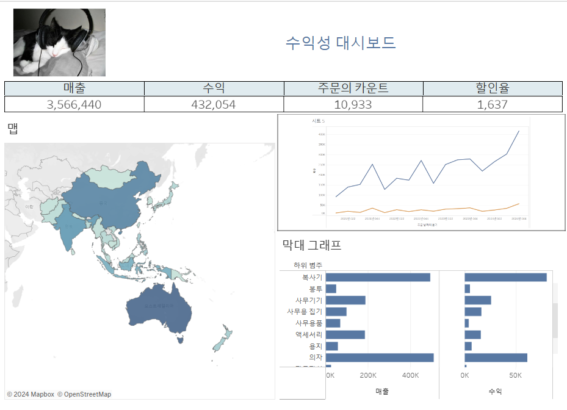

# Sixth Study Week


## Study Schedule
<br>

| 회차 | 강의 범위   | 강의 이수 여부 | 링크                                                                                                     |
|------|-------------|----------------|--------------------------------------------------------------------------------------------------------|
| 1    | 1~7강       | ✅              | [링크](https://www.youtube.com/watch?v=AXkaUrJs-Ko&list=PL87tgIIryGsa5vdz6MsaOEF8PK-YqK3fz&index=84)    |
| 2    | 8~17강      | ✅              | [링크](https://www.youtube.com/watch?v=AXkaUrJs-Ko&list=PL87tgIIryGsa5vdz6MsaOEF8PK-YqK3fz&index=75)    |
| 3    | 18~27강     | ✅              | [링크](https://www.youtube.com/watch?v=AXkaUrJs-Ko&list=PL87tgIIryGsa5vdz6MsaOEF8PK-YqK3fz&index=65)    |
| 4    | 28~37강     | ✅              | [링크](https://www.youtube.com/watch?v=e6J0Ljd6h44&list=PL87tgIIryGsa5vdz6MsaOEF8PK-YqK3fz&index=55)    |
| 5    | 38~47강     | ✅              | [링크](https://www.youtube.com/watch?v=AXkaUrJs-Ko&list=PL87tgIIryGsa5vdz6MsaOEF8PK-YqK3fz&index=45)    |
| 6    | 48~57강     | ✅              | [링크](https://www.youtube.com/watch?v=AXkaUrJs-Ko&list=PL87tgIIryGsa5vdz6MsaOEF8PK-YqK3fz&index=35)    |
| 7    | 58~67강     | 🍽️             | [링크](https://www.youtube.com/watch?v=AXkaUrJs-Ko&list=PL87tgIIryGsa5vdz6MsaOEF8PK-YqK3fz&index=25)    |
| 8    | 68~77강     | 🍽️             | [링크](https://www.youtube.com/watch?v=AXkaUrJs-Ko&list=PL87tgIIryGsa5vdz6MsaOEF8PK-YqK3fz&index=15)    |
| 9    | 78~85강     | 🍽️             | [링크](https://www.youtube.com/watch?v=AXkaUrJs-Ko&list=PL87tgIIryGsa5vdz6MsaOEF8PK-YqK3fz&index=5)     |
---

<br/>
<!-- 여기까진 그대로 둬 주세요-->

> **🧞‍♀️ 오늘은 강의보다 실습과 대시보드 직접 만들기가 더 중요하니, 기록보다는 사고하며 강의를 들어주세요.**

## 48. 워크시트 서식(2)

- 서식 탭 -> 테두리 선택 : 테두리 유형, 두께, 색상 선택 가능

- 서식 탭 -> 라인 선택 : 뷰에서 표시된 데이터의 축에 대한 라인의 모양을 설정


## 49강. 대시보드패널

- 크기: 현재 대시보드 크기 설정 : 드롭다운 메뉴로 구성되어 크기 선택 가능
- 시트: 대시보드에서 사용할 수 있는 워크시트들 현재 통합 문서에 존재
- 개체: 사용자가 만든 시트 외 다른 개체 추가하여 대시보드 구성 가능 : 텍스트, 이미지, 웹페이지 등등
- 기기 유형별 해상도 및 크기 설정 가능 (기기 미리보기 활용)


## 50. 대시보드 구성방식

> **🧞‍♀️ 부동과 바둑판식 방식을 차이를 중점으로 기술해보세요**
- 바둑판식 : 격자무늬
- 부동 : 개체를 자유롭게 배치 원하는 곳에 드래그앤드랍
~~~
대시보드의 크기가 자주 변경되는 경우에 개체를 추가하면 바둑판식 추천. 대시보드 크기를 변경해도 개체가 유사한 형식을 유지할 수 있음. 부동은 개체들을 추가하면 해당 개체의 위치 또는 형식이 다를 수 있음. (대시보드 크기가 자주 변경되지 않는 경우에 사용 추천 )
~~~


## 51. 대시보드 컨테이너
- 컨테이너 : 대시보드 개체들과 워크시트들을 그룹화하고 구성할 수 있는 공간
- 가로 컨테이너 : 내부의 개체들을 수평공간으로 배열할 때 사용 -> 열로 구성
- 세로 컨테이너 : 내부의 개체들을 수직공간으로 배열할 때 사용 -> 행으로 구성
~~~
개체를 대시보드에 배치하기 전에 컨테이너를 먼저 배치
*빈페이지는 공백 채우기로 배치 -> 용지 크기 포맷시 도움이 됨
*제대로 배치되었는지 확인하고 싶을 때는 "레이아웃 탭"에 "항목계층" 항목 확인
~~~



## 52. 레이아웃 패널
```
- 레이아웃 패널
    - 제목 표시 : 제목 숨기기 가능
    - 부동 : 부동 개체로 변경 가능
    - 위치, 크기 : 개체의 위치와 크기를 픽셀 단위로 변경 가능 (부동 개체에만 변경 가능)
    - 테두리 : 각 개체의 테두리 색, 두께 등 설정 가능
    - 백그라운드 : 개체의 백그라운드 색상 변경 가능
    - 바깥쪽 여백, 안쪽 여백 : 테두리를 기준으로 여백 설정 가능
    - 항목 : 대시보드에 있는 컨테이너와 개체를 볼 수 있음
```

## 53. 필터 동작

- 이름: 동작의 이름 설정
- 원본 시트: 필터의 기준이 될 시트 선택
- 동작 실행 조건
 - 마우스오버: 차트의 요소에 마우스를 올려둘 때 필터링 적용
 - 선택: 차트의 특정 요소를 클릭했을 때 필터링 적용
 - 메뉴: 차트의 요소를 클릭한 후 텍스트 옵션을 선택할 때 필터링 적용
- 대상 시트: 필터가 적용될 시트 선택
 - 선택 해제 시 결과 처리
 - 필터링된 값 유지: 선택 해제 후에도 필터된 값이 유지됨
 - 모든 값 표시: 선택 해제 시 모든 데이터 표시


## 54. 대시보드 하이라이터 동작

- 하이라이트 동작 : 대시보드에서 데이터를 선택했을 때 하이라이트로 구분할 수 있음


## 55. 대시보드 URL

- URL : 대시보드와 상호작용을 하면 웹 사이트로 이동할 수 있음


## 56. 대시보드 시트에 이동 동작

<!-- 대시보드 시트에 이동에 대해 알게 된 점을 적어주세요!-->

## 57. 매개변수 변경 동작

<!-- 매개변수 변경 동작에 대해 알게 된 점을 적어주세요!-->

## 문제

오늘은 별도의 문제가 없습니다. 


여러 대시보드를 참고하시어, superstore 데이터를 사용해 나만의 대시보드를 제작해주세요.

**단, 워크시트 3개 이상의 그래프를 표시해야 하며 각 시트 간 상호작용성 필터 or 하이라이트 동작은 꼭 추가되어야 합니다**

어떤 부분에 가중을 두었는지, 어떤 사용자 편의성을 고려하였는지에 대한 설명이 필요합니다.
